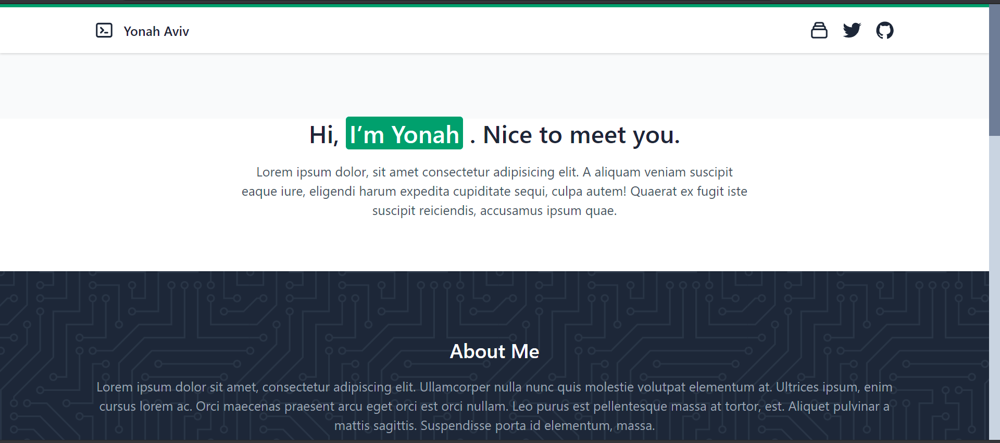

# Generolio

### By [Yonah Aviv](https://yonah.vercel.app)

__Description__: Generate web-dev quality portfolio with this no-code solution

This project was at first made just for Open Source Sunday of June 11 in the [Slingshot](https://slingshotahead.com/) discord server, but will become a legitimate project and will turn into a polished website at the end of the summer.

Using a boilerplate from someplace for Tailwind, Typescript, Svelte, and Snowpack. 

## Demo
Funtionality in terms of user-customization is yet to be implemented.

Copyright © 2021 Yonah Aviv under the terms of MIT license
